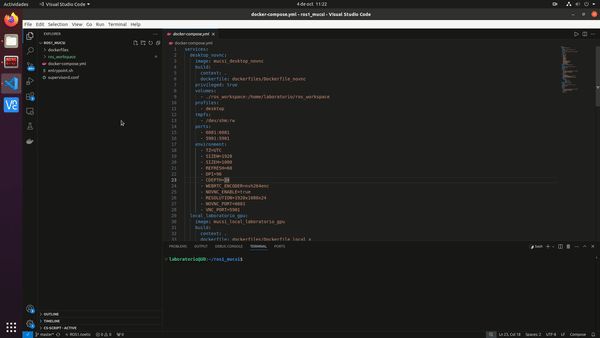
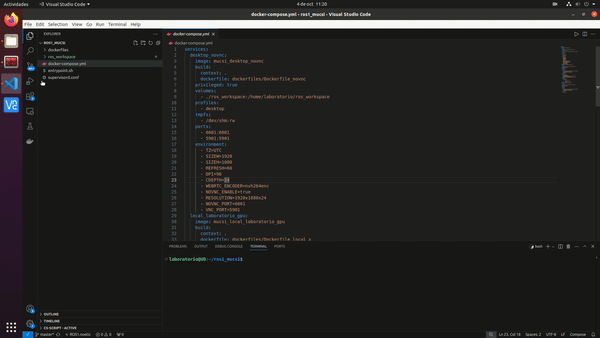

# Robótica y Automatización Inteligente - Entorno de desarrollo

Este repositorio proporciona un entorno de trabajo basado en ROS (Robot Operating System) para la asignatura de Robótica y Automatización Inteligente del Máster de Computación y Sistemas Inteligentes en la Universidad de Deusto. El entorno está empaquetado en contenedores Docker para asegurar la portabilidad y facilidad de uso.

## Herramientas Utilizadas

Antes de comenzar, asegúrate de tener instaladas las siguientes herramientas:

1. [Docker](https://www.docker.com/get-started): Docker es una plataforma para desarrollar, ejecutar y enviar aplicaciones dentro de contenedores. Puedes seguir [estas instrucciones](https://docs.docker.com/get-docker/) para instalar Docker en tu sistema.

2. [Visual Studio Code](https://code.visualstudio.com/): Utilizaremos VSCode para desarrollar dentro de los contenedores utilizando la extensión de [Remote - Containers](https://code.visualstudio.com/docs/remote/containers). Puedes instalar VSCode desde [aquí](https://code.visualstudio.com/download).

3. [Extensión Remote - Containers de VSCode](https://marketplace.visualstudio.com/items?itemName=ms-vscode-remote.remote-containers): Permite conectar VSCode a entornos de desarrollo que se ejecutan en contenedores Docker. Puedes instalarla desde el [marketplace de VSCode](https://marketplace.visualstudio.com/items?itemName=ms-vscode-remote.remote-containers).

4. [Git](https://git-scm.com/): Git es un sistema de control de versiones que utilizaremos para clonar este repositorio y gestionar versiones de código. Sigue [estas instrucciones](https://git-scm.com/book/en/v2/Getting-Started-Installing-Git) para instalar Git en tu sistema.


Opcionalmente, si trabajas en Linux, tienes una tarjeta gráfica NVIDIA y tu distribución utiliza el sistema de ventanas basado en X, puedes conseguir aceleración por GPU instalando:

-  [NVIDIA Container Toolkit](https://docs.nvidia.com/datacenter/cloud-native/container-toolkit/install-guide.html): Si planeas utilizar GPU para tus aplicaciones, necesitarás el soporte de GPU en Docker. Sigue la [guía de instalación de NVIDIA](https://docs.nvidia.com/datacenter/cloud-native/container-toolkit/install-guide.html) para habilitar esta funcionalidad.

## Requisitos del Sistema

- **Linux/macOS/Windows**: Docker y VSCode son compatible con todas estas plataformas, aunque algunas características pueden variar.
- **GPU** (opcional): Para aprovechar la aceleración de hardware, asegúrate de tener una GPU NVIDIA compatible y los drivers instalados.

## Contenedores Disponibles

Este repositorio incluye los siguientes contenedores:

1. **desktop**: Un entorno de escritorio accesible vía web (noVNC) con ROS instalado. Este contenedor funciona en cualquier SO y HW que tenga Docker instalado.
2. **local_gpu**: Un entorno local con soporte para GPU, optimizado para trabajos en el laboratorio.
3. **local**: Un entorno local sin soporte para GPU, para usar en entornos sin aceleración de hardware.

Los contenedores 2 y 3 están desarrollados para ser utilizados en los PCs del laboratorio de robótica. Sólo se pueden utilizar si se cumplen los siguientes requisitos:
- El sistema operativo host es Linux (o WSL).
- El sistema operativo host utiliza el sistema de ventanax X.
- (versión GPU) El sistema tiene una gráfica NVIDIA con el nvidia-container-toolkit y sus drivers instalados.

Para el uso personal fuera del laboratorio se recomienda utilizar el contenedor **desktop**.
## Instalación

### 1. Clonar este repositorio

Clona este repositorio en tu máquina local:

```bash
git clone https://github.com/ignacioDeusto/ros1_mucsi.git
```
```bash
cd ros1_mucsi
```

### 2. Construir la imagen de los contenedores
Depende del contenedor que se quiera utilizar, construir uno u otro (`local`, `local_gpu`, `desktop`). Se recomienda utilizar utilizar el contenedor `desktop` para uso personal y `local_gpu` en el laboratorio.

Una vez elegido el contenedor ejecutar:
```bash
docker compose --profile <nombre_contenedor_elegido> build
```
Cuando acabe el proceso ya se dispondrá de la imagen construida en el sistema.
### 3. Lanzar el contenedor
Una vez construida la imagen es posible crear contenedores a partir de ella. En este caso los contenedores están diseñados para utilizarlos como entornos de desarrollo. Se recomienda crear y utilizar un solo contenedor. Para esto ejecutar:
```bash
docker compose --profile <nombre_contenedor_elegido> up
```
Una vez lanzado, la terminal se mantendrá ejecutando el contenedor hasta que se pare. Para pararlo basta con enviar una señal de terminación `ctrl`+`c`.

Es posible y recomendable gestionar el lanzamiento y parada de los contenedores desde la extensión remote de VSCode. Para gestionar la parada y lanzamiento de los contenedores ya creados desde VSCode:
<p align="center">
    
</p>

### 4. Acceso al contenedor
Es posible acceder al contenedor creado de varias maneras:
- Si el contenedor utilizado es el `desktop`, desde cualquier navegador se puede acceder a él en [esta dirección](http://localhost:6081). **La contraseña es laboratorio**. En esta dirección se sirve un escritorio funcional completo.
- Para todos los contenedores se recomienda asociar una instancia de VSCode al contenedor utilizando la extension "remote explorer". Esto permite desarrollar en VSCode como si se trabajara en local, pero ejecutando todo en el contenedor.

Incluso si se utiliza el contenedor `desktop` se recomienda desarrollar y lanzar todo desde VSCode y utilizar el escritorio para ver la salida gráfica del sistema. Para conectarse al contenedor desde VSCode:
<p align="center">
    
</p>

### 5. Primeros pasos en ROS
Dentro de los contenedores se incluye un espacio de trabajo de ROS con todos los elementos necesarios para poder trabajar con los robots del laboratorio.

Antes de poder utilizarlos es necesario construir el espacio de trabajo base. Para construir el espacio de trabajo:

1. Conectarse al contenedor desde una instancia de VSCode.
2. Abrir una nueva terminal en VSCode.
3. Navegar hasta el directorio base del espacio de trabajo:
```bash
cd /home/laboratorio/ros_workspace
```
4. Actualizar la lista de paquetes disponibles del sistema:
```bash
sudo apt update
```
5. Actualizar el gestor de paquetes de ROS:
```bash
rosdep update
```
6. Instalar todas las dependencias del espacio de trabajo base:
```bash
rosdep install --from-paths src --ignore-src -r -y
```
7. Construir el espacio de trabajo:
```bash
catkin build
```
Si todo se ha ejecutado de manera correcta, el espacio de trabajo ya está en condiciones de uso.

Antes de poder utilizar el espacio de trabajo hay que activarlo en la terminal:
```bash
source /home/laboratorio/ros_workspace/devel/setup.bash
```
>**IMPORTANTE:**
**<u>La activación del espacio de trabajo se debe realizar en cada nueva terminal abierta en la que se quiera utilizar algo relacionado con este.</u>**

Si siempre se va a utilizar el mismo espacio de trabajo, es posible incluir la activación en el fichero `/home/laboratorio/.bashrc` que se ejecuta cada vez que se abre una nueva terminal. Si se incluye, no hace falta volver a activar el espacio de trabajo.

Para comprobar que el sistema funciona correctamente, ejecutar en la terminal donde se ha activado el espacio de trabajo:
```bash
roslaunch launcher_robots_lab_robotica sim_203.launch
```
Esto debería ejecutar todos los nodos necesarios para poder controlar uno de los Universal Robots en simulación. Debería aparecer una interfaz gráfica en la que se muestra el robot y si se selecciona el grupo de planificación `robot`, debería permitir moverlo a diferentes posiciones, planificar y ejecutar trayectorias.

El control de los robots se realizará utilizando el framework MoveIt! que abstrae los topics de ROS y proporciona funcionalidades para planificar y ejecutar trayectorias además de gestionar la escena de planificación. Se puede encontrar documentación extensa de su API de Python [aquí](https://moveit.github.io/moveit_tutorials/doc/move_group_python_interface/move_group_python_interface_tutorial.html).
### Aspectos a considerar en el desarrollo

- Todo lo que se instale, ejecute y modifique a partir de la creación se pierde si el contenedor se elimina. Si el contenedor se para en vez de eliminarlo, mantendrán todas las modificaciones hechas cuando se vuelva a lanzar.
- Los contenedores comparten un directorio con el host. Todo cambio que se haga en este desde el contenedor se verá reflejado en el host y viceversa. Este directorio en el contenedor es: `/home/laboratorio/ros_workspace` y en el host depende de donde y cómo se haya creado el contenedor.
- No confundir el host con el contenedor (estarán en instancias separadas de VSCode).
- No lanzar docker compose down. Si se lanza, el contenedor se eliminará.
